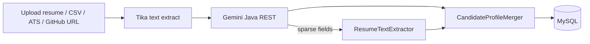

# Multi-Source Candidate Data Transformer

Ingest candidate data from resumes, GitHub profiles, recruiter CSV exports, and ATS JSON. Parse, normalize, merge into a canonical profile, and expose it through a REST API and React UI.

## Architecture



| Layer | Stack |
|-------|-------|
| Backend | Spring Boot 3.4, Java 21, MySQL, Flyway |
| Frontend | React 19, Vite, TypeScript, Tailwind CSS v4 |
| Resume extraction | Apache Tika → Gemini (structured JSON) → heuristic fallback |
| GitHub | GitHub REST API only |

**Not included:** LinkedIn scraping, Python/Playwright scripts, or external email validation.

## Project layout

```
Multi-source-candidate-data-transformer/
├── backend/          # Spring Boot API, parsers, merge pipeline
├── frontend/         # React SPA (upload, list, candidate detail)
└── docs/             # System design (CANDIDATE_PROFILE_TRANSFORMATION_SYSTEM.md)
```

## Prerequisites

- **Java 21** and **Maven**
- **Node.js 20+** and **npm**
- **MySQL 8** (local instance, e.g. `root` / `root`)
- **Gemini API key** (recommended for resume experience/education extraction)
- **Redis** (optional — `docker compose up -d` in `backend/`)

## Quick start

### 1. Backend

```bash
cd backend
cp .env.example .env
# Edit .env — set GEMINI_API_KEY at minimum

docker compose up -d   # optional Redis
mvn spring-boot:run
```

Health: http://localhost:8080/actuator/health

### 2. Frontend

```bash
cd frontend
npm install
npm run dev
```

App: http://localhost:5173 (API proxied to port 8080)

### 3. Try it

1. Open **Upload** and attach a resume PDF (optionally GitHub URL, CSV, or ATS JSON).
2. Click **Process** and wait for status `COMPLETED`.
3. Open the candidate profile — check **Experience**, **Education**, and **Confidence** tabs.

## Configuration

Copy `backend/.env.example` to `backend/.env`:

| Variable | Required | Description |
|----------|----------|-------------|
| `GEMINI_API_KEY` | Recommended | Google AI Studio key for structured resume parsing |
| `GEMINI_ENABLED` | No | Default `true` — set `false` for heuristic-only parsing |
| `GITHUB_TOKEN` | No | Higher GitHub API rate limits |
| `DB_PASSWORD` | No | MySQL password (default `root`) |

See [backend/README.md](backend/README.md) for backend details and [frontend/README.md](frontend/README.md) for frontend development.

## Source parsers

| Source | Parser | What it extracts |
|--------|--------|------------------|
| Resume (PDF/DOCX) | `ResumeParserService` | Name, contact, skills, experience, education |
| GitHub URL | `GitHubService` | Name, bio, location, repo languages, avatar, links |
| Recruiter CSV | `CsvImportService` | Tabular candidate fields |
| ATS JSON | `AtsJsonService` | JSONPath-mapped ATS fields |

Resume parsing flow:

1. **Tika** extracts plain text from the file.
2. **Gemini** returns structured JSON (company, title, institution, degree, etc.).
3. **`ResumeTextExtractor`** fills gaps when Gemini returns empty experience or education.

Field-level confidence scores (`full_name`, `emails`, `phones`, `experience`, `education`, `skills`) are written during merge and shown on the **Confidence** tab.

## API overview

| Method | Path | Description |
|--------|------|-------------|
| `POST` | `/api/v1/candidate/upload` | Multipart upload (resume, CSV, ATS JSON, GitHub URL) |
| `POST` | `/api/v1/candidate/process` | Start async processing |
| `GET` | `/api/v1/candidate` | List candidates (paginated) |
| `GET` | `/api/v1/candidate/{id}` | Full profile (`?includeConfidence=true` for Confidence tab) |
| `POST` | `/api/v1/candidate/{id}/reprocess` | Re-run pipeline |

## Documentation

- [System design](docs/CANDIDATE_PROFILE_TRANSFORMATION_SYSTEM.md) — full architecture, data model, API spec
- [Backend README](backend/README.md) — run, config, parsers
- [Frontend README](frontend/README.md) — dev server, build, routes

## Legacy notes

- `SourceType.LINKEDIN` remains in the database enum for existing rows but has no parser; reprocessing those sources returns `PARSER_UNAVAILABLE`.
- Email `validationStatus` is always `null` (validation service removed).
