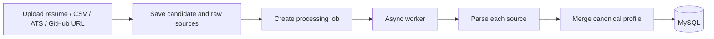

# Multi-Source Candidate Data Transformer

Ingest candidate data from resumes, GitHub profiles, recruiter CSV exports, and ATS JSON. Parse, normalize, merge into a canonical profile, and expose it through a REST API and React UI.

## Architecture



| Layer | Stack |
|-------|-------|
| Backend | Spring Boot 3.4, Java 21, MySQL, Flyway |
| Frontend | React 19, Vite, TypeScript, Tailwind CSS v4 |
| Async processing | Spring `@Async` + MySQL-backed `processing_job` tracking |
| Resume extraction | Tika or Docling → Ollama → heuristic fallback |
| GitHub | GitHub REST API only |

## Prerequisites

- **Java 21** and **Maven**
- **Node.js 20+** and **npm**
- **MySQL 8**
- **Ollama desktop app** — local LLM (no Docker, no cloud API key)

## Quick start

### 1. Backend

```bash
cd backend
cp .env.example .env
mvn spring-boot:run
```

Health: http://localhost:8080/actuator/health  
Ollama: http://localhost:11434

### 2. Frontend

```bash
cd frontend
npm install
npm run dev
```

App: http://localhost:5173

### 3. Try it

1. Upload a resume PDF on the **Upload** page.
2. Click **Process** and wait for `COMPLETED`.
3. Check **Experience**, **Education**, and **Confidence** tabs.

## Configuration

| Variable | Description |
|----------|-------------|
| `OLLAMA_MODEL` | Local Ollama model name |
| `OLLAMA_BASE_URL` | Default `http://localhost:11434/v1` |
| `RESUME_TEXT_PROVIDER` | `tika` (default) or `docling` |
| `GITHUB_TOKEN` | Optional, higher GitHub API rate limits |
| `APP_PROCESSING_MAX_ATTEMPTS` | Retry count for unexpected async worker failures |

See [backend/README.md](backend/README.md) and [docs/CANDIDATE_PROFILE_TRANSFORMATION_SYSTEM.md](docs/CANDIDATE_PROFILE_TRANSFORMATION_SYSTEM.md).

## API overview

| Method | Path | Description |
|--------|------|-------------|
| `POST` | `/api/v1/candidate/upload` | Multipart upload |
| `POST` | `/api/v1/candidate/process` | Start async processing |
| `GET` | `/api/v1/candidate/{id}/job/{jobId}` | Read async job status and failure details |
| `GET` | `/api/v1/candidate/{id}` | Full profile (`?includeConfidence=true`) |
| `POST` | `/api/v1/candidate/{id}/reprocess` | Re-run pipeline |
