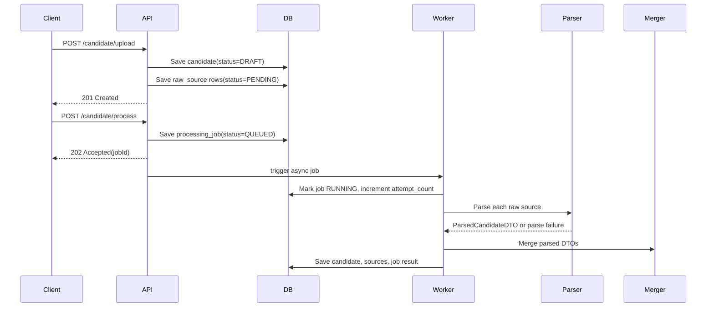

# Candidate Profile Transformation System

## Overview

This document describes the system that is implemented in the repository today.

The backend accepts multiple candidate inputs, stores them first, then runs asynchronous processing to parse, merge, and persist a canonical candidate profile.

## Current stack

| Area | Implementation |
|------|----------------|
| Backend | Spring Boot 3.4, Java 21 |
| Persistence | MySQL + Spring Data JPA + Flyway |
| Async execution | Spring `@Async` with `ThreadPoolTaskExecutor` |
| File storage | Local filesystem under `storage/` |
| Resume text extraction | Tika or Docling |
| LLM extraction | Local Ollama |
| External profile source | GitHub REST API |

## System flow

## Upload-first design

The system always persists data before starting background processing.

1. A candidate row is created first with status `DRAFT`.
2. Every uploaded source becomes a `raw_source` row with status `PENDING`.
3. Processing is started only by a separate process request.

This keeps upload latency short and allows reprocessing without uploading the same files again.

## Queue and worker model

There is no external broker in the current implementation.

- The durable queue state is the `processing_job` table in MySQL.
- The in-memory execution queue is Spring's `ThreadPoolTaskExecutor`.
- The worker is `CandidateProcessingService.runAsync`.

Job lifecycle:

`QUEUED -> RUNNING -> COMPLETED`

or

`QUEUED -> RUNNING -> QUEUED` for retryable worker failures

or

`QUEUED -> RUNNING -> FAILED` for terminal failures

## Retry logic

Retry is used for unexpected worker-level failures such as transient runtime or infrastructure exceptions.

- Each job stores `attempt_count`, `max_attempts`, and `last_attempt_at`.
- `max_attempts` is configured by `APP_PROCESSING_MAX_ATTEMPTS` and defaults to `3`.
- When a worker attempt throws an unexpected exception, the job returns to `QUEUED` if attempts remain.
- When no attempts remain, the candidate and job are marked `FAILED` and the last error message is persisted.

Retry is not used for deterministic source parse failures. Those are recorded per source and the candidate may still finish as `PARTIAL`.

## Failure handling

### Source-level failure

If one source fails to parse:

- `raw_source.status = FAILED`
- `raw_source.error_code` is stored
- `raw_source.error_message` is stored
- the worker continues with the remaining sources

If at least one source succeeds, the candidate can still end as `PARTIAL`.

### Worker-level failure

If the worker fails before reaching a terminal result:

- the current attempt is recorded on `processing_job`
- the job is retried while attempts remain
- the final failure reason is stored in `processing_job.error_message`

### User-visible failure notification

The current system exposes failure information through polling rather than push notifications.

Clients should poll:

`GET /api/v1/candidate/{candidateId}/job/{jobId}`

The response includes:

- `status`
- `attemptCount`
- `maxAttempts`
- `errorMessage`

That is the supported way for the UI to notify the user that processing failed.

## Candidate status model

| Status | Meaning |
|--------|---------|
| `DRAFT` | Uploaded but not yet processing |
| `PROCESSING` | Job is queued or running |
| `COMPLETED` | Processing succeeded |
| `PARTIAL` | At least one source succeeded and at least one source failed |
| `FAILED` | No usable parsed output or the worker exhausted retries |

## Core components

| Component | Responsibility |
|-----------|----------------|
| `CandidateController` | Upload, process, reprocess, read, and job-status endpoints |
| `CandidateService` | Request orchestration and response mapping |
| `CandidateProcessingService` | Async execution, retries, source parsing, merge, status transitions |
| `SourceParserFactory` | Resolves a parser for each `SourceType` |
| `CandidateProfileMerger` | Merges parsed source DTOs into the canonical candidate |
| `SkillNormalizationService` | Resolves skill aliases during merge |
| `ProfileProjectionService` | Projects canonical profile to runtime config output |
| `ProfilePictureService` | Resolves and stores the preferred profile picture |

Design overview: [TECHNICAL_DESIGN.md](TECHNICAL_DESIGN.md)

## Data model for async processing

### `candidate`

- Canonical merged profile
- Top-level lifecycle status

### `raw_source`

- One row per uploaded or referenced input
- Per-source parse status and failure metadata

### `processing_job`

- One row per processing or reprocessing request
- Async job state, attempt counters, and terminal error message

## Reprocessing

Reprocessing does not require re-uploading files.

1. Existing `raw_source` rows are reset to `PENDING`.
2. Previous source error metadata is cleared.
3. Candidate status returns to `DRAFT`.
4. A new `processing_job` is created and the async flow starts again.

## Non-goals in the current implementation

These items are not implemented in the repository and are intentionally excluded from this design:

- External message brokers beyond the MySQL-backed job table
- GraphQL API
- LinkedIn scraping
- SMTP or push notifications
- MSSQL-specific infrastructure

## Suggested UI behavior

The frontend should treat processing as a two-step flow:

1. Upload and store the candidate.
2. Start processing and poll the job-status endpoint until `COMPLETED` or `FAILED`.

If the job returns `FAILED`, show `errorMessage` and the final attempt count to the user.
