# Candidate Profile Transformation System
## High-Level Design (HLD) + Low-Level Design (LLD)

**Version:** 1.0  
**Date:** 2026-06-29  
**Stack:** Java 21 · Spring Boot 3 · MSSQL · Redis · GraphQL · REST

---

## Table of Contents

### High-Level Design
1. [System Overview](#1-system-overview)
2. [High-Level Architecture Diagram](#2-high-level-architecture-diagram)
3. [Component Responsibilities](#3-component-responsibilities)
4. [End-to-End Request Flow](#4-end-to-end-request-flow)
5. [Deployment Architecture](#5-deployment-architecture)
6. [Non-Functional Requirements](#6-non-functional-requirements)
7. [Security Design](#7-security-design)

### Low-Level Design
8. [Folder Structure](#8-folder-structure)
9. [Spring Boot Package Structure](#9-spring-boot-package-structure)
10. [Database ER Diagram](#10-database-er-diagram)
11. [Complete Database Schema (MSSQL DDL)](#11-complete-database-schema-mssql-ddl)
12. [REST API Design](#12-rest-api-design)
13. [GraphQL Schema](#13-graphql-schema)
14. [Service Class Diagram](#14-service-class-diagram)
15. [Merge Algorithm](#15-merge-algorithm)
16. [Confidence Algorithm](#16-confidence-algorithm)
17. [Provenance Design](#17-provenance-design)
18. [Runtime Config Engine Design](#18-runtime-config-engine-design)
19. [Redis Cache Strategy](#19-redis-cache-strategy)
20. [Rate Limiter Design](#20-rate-limiter-design)
21. [File Storage Design](#21-file-storage-design)
22. [UI Specifications](#22-ui-specifications)
23. [Error Handling and Resilience](#23-error-handling-and-resilience)
24. [Sequence Diagrams (Detailed)](#24-sequence-diagrams-detailed)

---

# Part 1 — High-Level Design (HLD)

## 1. System Overview

### 1.1 Problem Statement

Recruitment platforms receive candidate information from many heterogeneous sources — resumes, social profiles, ATS exports, and recruiter spreadsheets. Each source uses different field names, formats, and levels of completeness. The Candidate Profile Transformation System ingests any combination of these inputs and produces a **single canonical candidate profile** with normalized fields, deduplicated collections, conflict-resolved scalars, per-field confidence scores, and full provenance tracking.

### 1.2 Supported Input Sources

| Category | Source | Format |
|----------|--------|--------|
| Structured | Recruiter CSV Export | CSV |
| Structured | ATS JSON Blob | JSON |
| Unstructured | Resume | PDF / DOCX |
| Unstructured | LinkedIn Profile URL | HTML (scraped) |
| Unstructured | GitHub Profile URL | REST / GraphQL API |

### 1.3 Core Capabilities

- **Parse** — Extract structured data from each source via Strategy-pattern parsers
- **Normalize** — Email validation, E.164 phone formatting, skill alias resolution
- **Merge** — Priority-based conflict resolution across sources
- **Score** — Per-field and overall confidence assignment
- **Track** — Provenance for every canonical field value
- **Project** — Runtime-configurable output mapping without code changes
- **Validate** — Schema validation on projected output
- **Serve** — REST + GraphQL APIs and a 3-page Web UI

### 1.4 Design Principles

| Principle | Application |
|-----------|-------------|
| SOLID | Single-responsibility services; parser Strategy; storage abstraction |
| Clean Architecture | Domain core isolated from infrastructure adapters |
| Repository Pattern | JPA repositories for all persistence |
| Strategy Pattern | One parser per source type |
| Factory Pattern | `SourceParserFactory` resolves parser by `SourceType` |
| Builder Pattern | `CanonicalProfileBuilder` for incremental merge |
| DTO Pattern | Separate request/response/domain layers |

---

## 2. High-Level Architecture Diagram

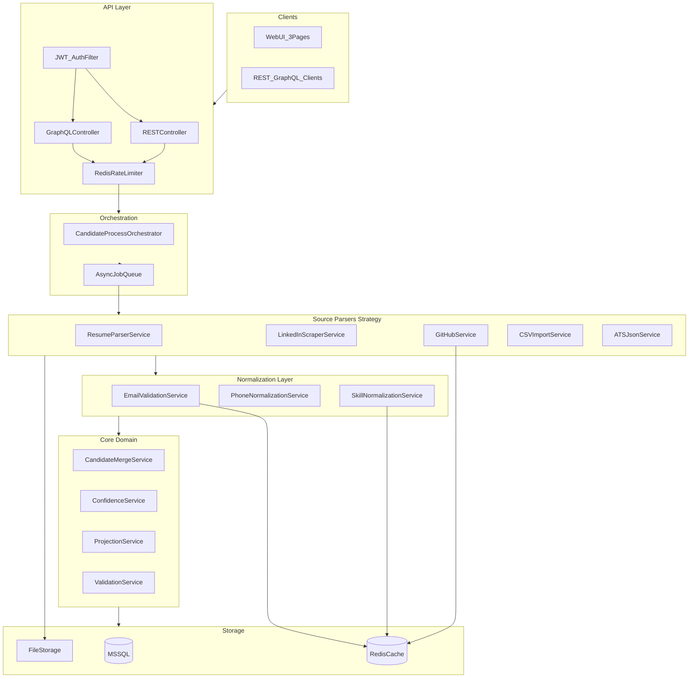

### Layer Summary

```
┌─────────────────────────────────────────────────────────┐
│  Presentation  │  REST · GraphQL · React Web UI         │
├─────────────────────────────────────────────────────────┤
│  Application   │  Orchestrator · DTO Mappers · Jobs     │
├─────────────────────────────────────────────────────────┤
│  Domain        │  Merge · Confidence · Projection       │
├─────────────────────────────────────────────────────────┤
│  Infrastructure│  Parsers · Redis · MSSQL · File Store  │
└─────────────────────────────────────────────────────────┘
```

---

## 3. Component Responsibilities

| Layer | Component | Responsibility |
|-------|-----------|----------------|
| **Presentation** | REST Controller | Upload, process, CRUD endpoints; OpenAPI docs |
| **Presentation** | GraphQL Controller | Field-selective candidate queries |
| **Presentation** | Web UI (React SPA) | Upload, list, detail pages |
| **Application** | `CandidateProcessOrchestrator` | Coordinate parse → normalize → merge → persist pipeline |
| **Application** | Async Job Queue | Decouple long-running process from HTTP thread |
| **Domain** | `CandidateMergeService` | Priority-based field merge and deduplication |
| **Domain** | `ConfidenceService` | Per-field and overall confidence scoring |
| **Domain** | `ProjectionService` | Apply runtime config to canonical profile |
| **Domain** | `ValidationService` | Validate projected output against JSON Schema |
| **Infrastructure** | Source Parsers (5) | Extract `ParsedCandidateDTO` from raw input |
| **Infrastructure** | Normalizers (3) | Email, phone, skill normalization |
| **Infrastructure** | Redis | Cache + rate limiting |
| **Infrastructure** | MSSQL | Canonical profile persistence |
| **Infrastructure** | File Storage | Resume and profile image storage |

---

## 4. End-to-End Request Flow

### 4.1 Upload Flow

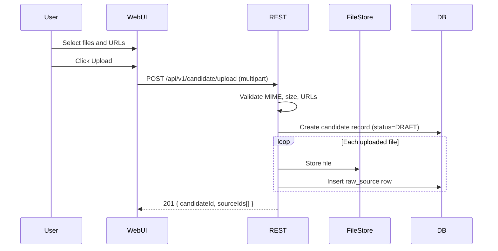

### 4.2 Process Flow

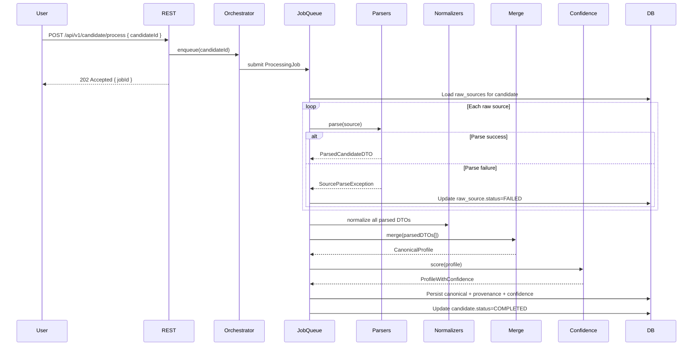

### 4.3 Reprocess Flow

Reprocess reuses stored raw sources and runtime config. The orchestrator skips upload, re-runs the full parse → merge → confidence pipeline, invalidates Redis cache for the candidate, and updates `updated_at`.

### 4.4 Read with Projection Flow

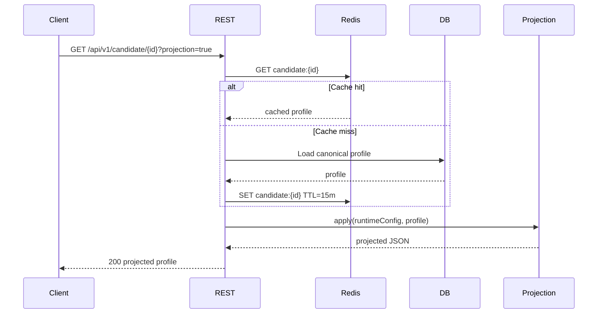

---

## 5. Deployment Architecture

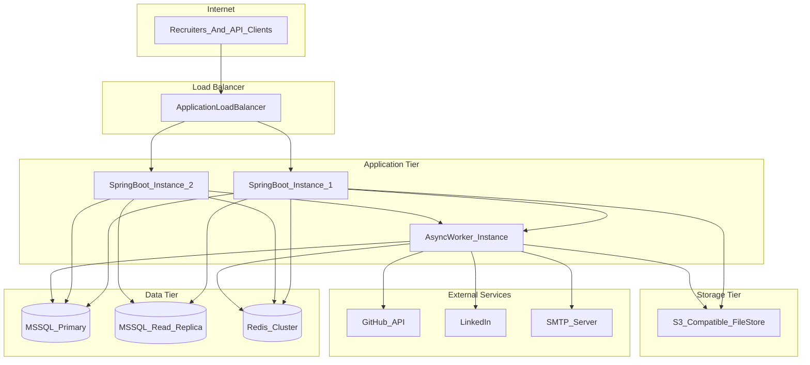

### Deployment Notes

| Concern | Approach |
|---------|----------|
| **Scaling** | Stateless app instances behind ALB; scale workers independently for parse-heavy workloads |
| **Database** | MSSQL primary for writes; optional read replica for list/search queries |
| **Cache** | Redis cluster (3+ nodes) for cache and rate limiter shared state |
| **Files** | S3-compatible object storage in production; local filesystem in dev |
| **Secrets** | LinkedIn credentials, GitHub token, DB password via AWS Secrets Manager / Azure Key Vault |
| **Monitoring** | Prometheus metrics + Grafana dashboards; structured JSON logs to ELK |
| **CI/CD** | GitHub Actions → Docker image → rolling deploy to Kubernetes or ECS |

### Environment Profiles

| Profile | Database | Redis | File Store | LinkedIn |
|---------|----------|-------|------------|----------|
| `dev` | Local MSSQL | Local Redis | Local disk | Mock scraper |
| `staging` | Staging MSSQL | Staging Redis | S3 staging bucket | Dummy account |
| `prod` | MSSQL HA cluster | Redis cluster | S3 prod bucket | Dummy account |

---

## 6. Non-Functional Requirements

| Requirement | Implementation |
|-------------|----------------|
| **Caching** | Redis cache-aside for email validation, skill aliases, GitHub responses, candidate reads |
| **Rate Limiting** | Redis sliding-window counter per client + endpoint |
| **Exception Handling** | `@ControllerAdvice` → RFC 7807 Problem Details |
| **Logging** | SLF4J + Logback JSON; correlation ID per request (`X-Request-Id`) |
| **Retry** | Resilience4j `@Retry` on GitHub API (3 attempts, exponential backoff) |
| **Circuit Breaker** | Resilience4j `@CircuitBreaker` on LinkedIn scraper (50% failure threshold) |
| **Async Processing** | `@Async` + `ProcessingJob` queue for process/reprocess endpoints |
| **Graceful Degradation** | Per-source error isolation; partial profiles on source failure |
| **Input Resilience** | No crash on malformed CSV, JSON, PDF, or invalid URLs |
| **Observability** | Micrometer metrics: parse duration, merge duration, source failure rate |
| **API Documentation** | SpringDoc OpenAPI 3 at `/swagger-ui.html` |

### Graceful Failure Matrix

| Input Problem | System Behavior |
|---------------|-----------------|
| Invalid Resume (corrupt PDF) | `raw_source.status=FAILED`, error logged; other sources still processed |
| Broken LinkedIn URL | Source marked FAILED; merge continues with remaining sources |
| Invalid GitHub URL / 404 | Source marked FAILED; circuit breaker prevents cascade |
| Empty CSV | Source marked FAILED with `EMPTY_INPUT` error code |
| Malformed ATS JSON | Source marked FAILED with parse error details |
| All sources fail | Candidate status=FAILED; no canonical profile persisted |

---

## 7. Security Design

### 7.1 Authentication and Authorization

- **JWT Bearer tokens** on all `/api/v1/**` endpoints
- Roles: `RECRUITER` (upload, process, read), `ADMIN` (delete, reprocess, config)
- GraphQL endpoints protected by same JWT filter
- Token expiry: 8 hours; refresh via `/api/v1/auth/refresh`

### 7.2 Input Validation

- Bean Validation (`@Valid`, `@NotBlank`, `@URL`) on all request DTOs
- File upload constraints: max 10 MB per file; allowed MIME types: `application/pdf`, `application/vnd.openxmlformats-officedocument.wordprocessingml.document`, `text/csv`, `application/json`
- Server-side MIME sniffing (Apache Tika) — reject extension/MIME mismatch
- URL validation: LinkedIn URLs must match `linkedin.com/in/*`; GitHub URLs must match `github.com/*`

### 7.3 Secrets Management

- LinkedIn dummy account credentials stored in secrets manager, injected at runtime
- GitHub personal access token stored in secrets manager
- SMTP credentials for email validation stored in secrets manager
- No secrets in source code or `application.yml` (use `${ENV_VAR}` placeholders)

### 7.4 Rate Limiting (Security)

- Prevents scraper abuse and DoS on upload/process endpoints
- See [Section 20 — Rate Limiter Design](#20-rate-limiter-design) for limits

### 7.5 File Storage Security

- Files stored outside web root; served via authenticated download endpoint
- Path traversal prevention: sanitize filenames; UUID-based storage paths
- Optional virus scan hook (ClamAV integration point) on upload

### 7.6 CORS

- Allowed origins: Web UI domain only
- Allowed methods: GET, POST, DELETE
- Credentials: true (for cookie-based auth if used)

---

# Part 2 — Low-Level Design (LLD)

## 8. Folder Structure

```
candidate-profile-system/
├── docs/
│   └── CANDIDATE_PROFILE_TRANSFORMATION_SYSTEM.md
├── frontend/                          # React + Vite SPA
│   ├── src/
│   │   ├── pages/
│   │   │   ├── UploadPage.tsx
│   │   │   ├── CandidateListPage.tsx
│   │   │   └── CandidateDetailPage.tsx
│   │   ├── components/
│   │   ├── api/
│   │   └── App.tsx
│   ├── package.json
│   └── vite.config.ts
├── src/
│   ├── main/
│   │   ├── java/com/eightfold/candidate/
│   │   └── resources/
│   └── test/
│       ├── java/com/eightfold/candidate/
│       └── resources/fixtures/
│           ├── sample-resume.pdf
│           ├── recruiter-export.csv
│           └── ats-candidate.json
├── docker/
│   ├── Dockerfile
│   └── docker-compose.yml             # MSSQL + Redis + App
├── pom.xml
└── README.md
```

---

## 9. Spring Boot Package Structure

```
com.eightfold.candidate
├── CandidateApplication.java
├── config/
│   ├── RedisConfig.java
│   ├── CacheConfig.java
│   ├── AsyncConfig.java
│   ├── GraphQLConfig.java
│   ├── OpenApiConfig.java
│   ├── SecurityConfig.java
│   └── Resilience4jConfig.java
├── controller/
│   ├── CandidateController.java
│   └── AuthController.java
├── graphql/
│   ├── CandidateQueryResolver.java
│   ├── CandidateFieldResolver.java
│   └── dto/                           # GraphQL-specific types
├── dto/
│   ├── request/
│   │   ├── CandidateUploadRequest.java
│   │   ├── CandidateProcessRequest.java
│   │   └── CandidateFilterRequest.java
│   └── response/
│       ├── CandidateResponse.java
│       ├── CandidateListResponse.java
│       └── JobAcceptedResponse.java
├── domain/
│   ├── entity/                        # JPA entities
│   ├── enums/
│   │   ├── SourceType.java
│   │   ├── SourceStatus.java
│   │   ├── CandidateStatus.java
│   │   └── MissingStrategy.java
│   └── model/
│       ├── CanonicalProfile.java
│       ├── ParsedCandidateDTO.java
│       └── RuntimeConfig.java
├── repository/
│   ├── CandidateRepository.java
│   ├── RawSourceRepository.java
│   ├── CandidateEmailRepository.java
│   └── ...                            # One repo per entity
├── service/
│   ├── parser/
│   │   ├── SourceParser.java          # Strategy interface
│   │   ├── SourceParserFactory.java   # Factory
│   │   ├── ResumeParserService.java
│   │   ├── LinkedInScraperService.java
│   │   ├── GitHubService.java
│   │   ├── CsvImportService.java
│   │   └── AtsJsonService.java
│   ├── normalize/
│   │   ├── EmailValidationService.java
│   │   ├── PhoneNormalizationService.java
│   │   └── SkillNormalizationService.java
│   ├── merge/
│   │   └── CandidateMergeService.java
│   ├── confidence/
│   │   └── ConfidenceService.java
│   ├── projection/
│   │   ├── ProjectionService.java
│   │   ├── RuntimeConfigEngine.java
│   │   ├── JsonPathResolver.java
│   │   └── NormalizationChain.java
│   ├── validation/
│   │   └── ValidationService.java
│   └── storage/
│       ├── FileStorageService.java
│       ├── LocalFileStorageService.java
│       └── S3FileStorageService.java
├── orchestrator/
│   └── CandidateProcessOrchestrator.java
├── job/
│   ├── ProcessingJob.java
│   └── ProcessingJobExecutor.java
├── filter/
│   └── RateLimitFilter.java
├── exception/
│   ├── SourceParseException.java
│   ├── ValidationException.java
│   ├── ProjectionException.java
│   ├── RateLimitExceededException.java
│   └── GlobalExceptionHandler.java
├── mapper/
│   └── CandidateMapper.java           # MapStruct
└── util/
    ├── DateUtils.java
    └── UrlUtils.java
```

---

## 10. Database ER Diagram

```mermaid
erDiagram
    candidate ||--o{ candidate_email : has
    candidate ||--o{ candidate_phone : has
    candidate ||--o{ candidate_skill : has
    candidate ||--o{ candidate_experience : has
    candidate ||--o{ candidate_education : has
    candidate ||--o{ candidate_link : has
    candidate ||--o{ candidate_provenance : has
    candidate ||--o{ candidate_confidence : has
    candidate ||--o{ raw_source : has
    candidate ||--o| runtime_config : has
    candidate ||--o| processing_job : has

    skill_alias ||--o{ candidate_skill : resolves

    candidate {
        uniqueidentifier candidate_id PK
        nvarchar full_name
        nvarchar headline
        decimal years_experience
        decimal overall_confidence
        nvarchar profile_picture_path
        nvarchar resume_path
        nvarchar location
        nvarchar status
        bit is_deleted
        datetime2 created_at
        datetime2 updated_at
    }

    candidate_email {
        bigint id PK
        uniqueidentifier candidate_id FK
        nvarchar email_address
        bit is_primary
        decimal confidence
    }

    candidate_phone {
        bigint id PK
        uniqueidentifier candidate_id FK
        nvarchar phone_e164
        bit is_primary
        decimal confidence
    }

    candidate_skill {
        bigint id PK
        uniqueidentifier candidate_id FK
        nvarchar skill_name
        nvarchar canonical_skill
        decimal confidence
        nvarchar source_type
    }

    candidate_experience {
        bigint id PK
        uniqueidentifier candidate_id FK
        nvarchar company
        nvarchar title
        date start_date
        date end_date
        bit is_current
        nvarchar description
        decimal confidence
        nvarchar source_type
    }

    candidate_education {
        bigint id PK
        uniqueidentifier candidate_id FK
        nvarchar institution
        nvarchar degree
        nvarchar field_of_study
        date start_date
        date end_date
        decimal confidence
        nvarchar source_type
    }

    candidate_link {
        bigint id PK
        uniqueidentifier candidate_id FK
        nvarchar link_type
        nvarchar url
        decimal confidence
    }

    candidate_provenance {
        bigint id PK
        uniqueidentifier candidate_id FK
        nvarchar field_path
        nvarchar source_type
        uniqueidentifier source_id FK
        nvarchar source_value
        nvarchar raw_value
        datetime2 captured_at
    }

    candidate_confidence {
        bigint id PK
        uniqueidentifier candidate_id FK
        nvarchar field_path
        decimal score
        nvarchar source_type
    }

    raw_source {
        uniqueidentifier source_id PK
        uniqueidentifier candidate_id FK
        nvarchar source_type
        nvarchar storage_path
        nvarchar original_filename
        nvarchar status
        nvarchar error_code
        nvarchar error_message
        datetime2 ingested_at
        datetime2 processed_at
    }

    runtime_config {
        bigint id PK
        uniqueidentifier candidate_id FK
        nvarchar config_json
        datetime2 created_at
    }

    processing_job {
        uniqueidentifier job_id PK
        uniqueidentifier candidate_id FK
        nvarchar status
        datetime2 started_at
        datetime2 completed_at
        nvarchar error_message
    }

    skill_alias {
        bigint id PK
        nvarchar alias
        nvarchar canonical_name
        datetime2 updated_at
    }
```

---

## 11. Complete Database Schema (MSSQL DDL)

```sql
-- V1__init.sql — Flyway migration

CREATE TABLE candidate (
    candidate_id        UNIQUEIDENTIFIER    NOT NULL DEFAULT NEWSEQUENTIALID(),
    full_name           NVARCHAR(255)       NULL,
    headline            NVARCHAR(500)       NULL,
    years_experience    DECIMAL(4,1)        NULL,
    overall_confidence  DECIMAL(5,4)        NULL,
    profile_picture_path NVARCHAR(1000)     NULL,
    resume_path         NVARCHAR(1000)      NULL,
    location            NVARCHAR(255)       NULL,
    status              NVARCHAR(20)        NOT NULL DEFAULT 'DRAFT',
    is_deleted          BIT                 NOT NULL DEFAULT 0,
    created_at          DATETIME2           NOT NULL DEFAULT SYSUTCDATETIME(),
    updated_at          DATETIME2           NOT NULL DEFAULT SYSUTCDATETIME(),
    CONSTRAINT PK_candidate PRIMARY KEY (candidate_id),
    CONSTRAINT CK_candidate_status CHECK (status IN ('DRAFT','PROCESSING','COMPLETED','PARTIAL','FAILED'))
);

CREATE TABLE raw_source (
    source_id           UNIQUEIDENTIFIER    NOT NULL DEFAULT NEWSEQUENTIALID(),
    candidate_id        UNIQUEIDENTIFIER    NOT NULL,
    source_type         NVARCHAR(30)        NOT NULL,
    storage_path        NVARCHAR(1000)      NULL,
    original_filename   NVARCHAR(255)       NULL,
    source_url          NVARCHAR(2000)      NULL,
    status              NVARCHAR(20)        NOT NULL DEFAULT 'PENDING',
    error_code          NVARCHAR(50)        NULL,
    error_message       NVARCHAR(MAX)       NULL,
    ingested_at         DATETIME2           NOT NULL DEFAULT SYSUTCDATETIME(),
    processed_at        DATETIME2           NULL,
    CONSTRAINT PK_raw_source PRIMARY KEY (source_id),
    CONSTRAINT FK_raw_source_candidate FOREIGN KEY (candidate_id) REFERENCES candidate(candidate_id),
    CONSTRAINT CK_raw_source_type CHECK (source_type IN ('RESUME','LINKEDIN','GITHUB','RECRUITER_CSV','ATS_JSON')),
    CONSTRAINT CK_raw_source_status CHECK (status IN ('PENDING','PROCESSING','COMPLETED','FAILED'))
);

CREATE TABLE candidate_email (
    id                  BIGINT IDENTITY(1,1) NOT NULL,
    candidate_id        UNIQUEIDENTIFIER    NOT NULL,
    email_address       NVARCHAR(255)       NOT NULL,
    is_primary          BIT                 NOT NULL DEFAULT 0,
    confidence          DECIMAL(5,4)        NULL,
    CONSTRAINT PK_candidate_email PRIMARY KEY (id),
    CONSTRAINT FK_candidate_email_candidate FOREIGN KEY (candidate_id) REFERENCES candidate(candidate_id),
    CONSTRAINT UQ_candidate_email UNIQUE (candidate_id, email_address)
);

CREATE TABLE candidate_phone (
    id                  BIGINT IDENTITY(1,1) NOT NULL,
    candidate_id        UNIQUEIDENTIFIER    NOT NULL,
    phone_e164          NVARCHAR(20)        NOT NULL,
    is_primary          BIT                 NOT NULL DEFAULT 0,
    confidence          DECIMAL(5,4)        NULL,
    CONSTRAINT PK_candidate_phone PRIMARY KEY (id),
    CONSTRAINT FK_candidate_phone_candidate FOREIGN KEY (candidate_id) REFERENCES candidate(candidate_id),
    CONSTRAINT UQ_candidate_phone UNIQUE (candidate_id, phone_e164)
);

CREATE TABLE candidate_skill (
    id                  BIGINT IDENTITY(1,1) NOT NULL,
    candidate_id        UNIQUEIDENTIFIER    NOT NULL,
    skill_name          NVARCHAR(255)       NOT NULL,
    canonical_skill     NVARCHAR(255)       NULL,
    confidence          DECIMAL(5,4)        NULL,
    source_type         NVARCHAR(30)        NULL,
    CONSTRAINT PK_candidate_skill PRIMARY KEY (id),
    CONSTRAINT FK_candidate_skill_candidate FOREIGN KEY (candidate_id) REFERENCES candidate(candidate_id),
    CONSTRAINT UQ_candidate_skill UNIQUE (candidate_id, canonical_skill)
);

CREATE TABLE candidate_experience (
    id                  BIGINT IDENTITY(1,1) NOT NULL,
    candidate_id        UNIQUEIDENTIFIER    NOT NULL,
    company             NVARCHAR(255)       NOT NULL,
    title               NVARCHAR(255)       NULL,
    start_date          DATE                NULL,
    end_date            DATE                NULL,
    is_current          BIT                 NOT NULL DEFAULT 0,
    description         NVARCHAR(MAX)       NULL,
    confidence          DECIMAL(5,4)        NULL,
    source_type         NVARCHAR(30)        NULL,
    CONSTRAINT PK_candidate_experience PRIMARY KEY (id),
    CONSTRAINT FK_candidate_experience_candidate FOREIGN KEY (candidate_id) REFERENCES candidate(candidate_id)
);

CREATE TABLE candidate_education (
    id                  BIGINT IDENTITY(1,1) NOT NULL,
    candidate_id        UNIQUEIDENTIFIER    NOT NULL,
    institution         NVARCHAR(255)       NOT NULL,
    degree              NVARCHAR(255)       NULL,
    field_of_study      NVARCHAR(255)       NULL,
    start_date          DATE                NULL,
    end_date            DATE                NULL,
    confidence          DECIMAL(5,4)        NULL,
    source_type         NVARCHAR(30)        NULL,
    CONSTRAINT PK_candidate_education PRIMARY KEY (id),
    CONSTRAINT FK_candidate_education_candidate FOREIGN KEY (candidate_id) REFERENCES candidate(candidate_id)
);

CREATE TABLE candidate_link (
    id                  BIGINT IDENTITY(1,1) NOT NULL,
    candidate_id        UNIQUEIDENTIFIER    NOT NULL,
    link_type           NVARCHAR(30)        NOT NULL,
    url                 NVARCHAR(2000)      NOT NULL,
    confidence          DECIMAL(5,4)        NULL,
    CONSTRAINT PK_candidate_link PRIMARY KEY (id),
    CONSTRAINT FK_candidate_link_candidate FOREIGN KEY (candidate_id) REFERENCES candidate(candidate_id),
    CONSTRAINT UQ_candidate_link UNIQUE (candidate_id, link_type, url)
);

CREATE TABLE candidate_provenance (
    id                  BIGINT IDENTITY(1,1) NOT NULL,
    candidate_id        UNIQUEIDENTIFIER    NOT NULL,
    field_path          NVARCHAR(255)       NOT NULL,
    source_type         NVARCHAR(30)        NOT NULL,
    source_id           UNIQUEIDENTIFIER    NULL,
    source_value        NVARCHAR(MAX)       NULL,
    raw_value           NVARCHAR(MAX)       NULL,
    captured_at         DATETIME2           NOT NULL DEFAULT SYSUTCDATETIME(),
    CONSTRAINT PK_candidate_provenance PRIMARY KEY (id),
    CONSTRAINT FK_candidate_provenance_candidate FOREIGN KEY (candidate_id) REFERENCES candidate(candidate_id),
    CONSTRAINT FK_candidate_provenance_source FOREIGN KEY (source_id) REFERENCES raw_source(source_id)
);

CREATE TABLE candidate_confidence (
    id                  BIGINT IDENTITY(1,1) NOT NULL,
    candidate_id        UNIQUEIDENTIFIER    NOT NULL,
    field_path          NVARCHAR(255)       NOT NULL,
    score               DECIMAL(5,4)        NOT NULL,
    source_type         NVARCHAR(30)        NULL,
    CONSTRAINT PK_candidate_confidence PRIMARY KEY (id),
    CONSTRAINT FK_candidate_confidence_candidate FOREIGN KEY (candidate_id) REFERENCES candidate(candidate_id),
    CONSTRAINT UQ_candidate_confidence UNIQUE (candidate_id, field_path)
);

CREATE TABLE runtime_config (
    id                  BIGINT IDENTITY(1,1) NOT NULL,
    candidate_id        UNIQUEIDENTIFIER    NOT NULL,
    config_json         NVARCHAR(MAX)       NOT NULL,
    created_at          DATETIME2           NOT NULL DEFAULT SYSUTCDATETIME(),
    CONSTRAINT PK_runtime_config PRIMARY KEY (id),
    CONSTRAINT FK_runtime_config_candidate FOREIGN KEY (candidate_id) REFERENCES candidate(candidate_id)
);

CREATE TABLE processing_job (
    job_id              UNIQUEIDENTIFIER    NOT NULL DEFAULT NEWSEQUENTIALID(),
    candidate_id        UNIQUEIDENTIFIER    NOT NULL,
    status              NVARCHAR(20)        NOT NULL DEFAULT 'QUEUED',
    started_at          DATETIME2           NULL,
    completed_at        DATETIME2           NULL,
    error_message       NVARCHAR(MAX)       NULL,
    CONSTRAINT PK_processing_job PRIMARY KEY (job_id),
    CONSTRAINT FK_processing_job_candidate FOREIGN KEY (candidate_id) REFERENCES candidate(candidate_id),
    CONSTRAINT CK_processing_job_status CHECK (status IN ('QUEUED','RUNNING','COMPLETED','FAILED'))
);

CREATE TABLE skill_alias (
    id                  BIGINT IDENTITY(1,1) NOT NULL,
    alias               NVARCHAR(255)       NOT NULL,
    canonical_name      NVARCHAR(255)       NOT NULL,
    updated_at          DATETIME2           NOT NULL DEFAULT SYSUTCDATETIME(),
    CONSTRAINT PK_skill_alias PRIMARY KEY (id),
    CONSTRAINT UQ_skill_alias UNIQUE (alias)
);

-- Indexes for list/search?search performance
CREATE INDEX IX_candidate_status_updated ON candidate(status, updated_at DESC) WHERE is_deleted = 0;
CREATE INDEX IX_candidate_full_name ON candidate(full_name) WHERE is_deleted = 0;
CREATE INDEX IX_candidate_email_address ON candidate_email(email_address);
CREATE INDEX IX_candidate_experience_company ON candidate_experience(company);
CREATE INDEX IX_raw_source_candidate ON raw_source(candidate_id, source_type);
CREATE INDEX IX_candidate_provenance_field ON candidate_provenance(candidate_id, field_path);
CREATE INDEX IX_skill_alias_alias ON skill_alias(alias);

-- Seed skill aliases
INSERT INTO skill_alias (alias, canonical_name) VALUES
    ('Node JS', 'Node.js'),
    ('NodeJS', 'Node.js'),
    ('JS', 'JavaScript'),
    ('Springboot', 'Spring Boot'),
    ('SpringBoot', 'Spring Boot'),
    ('K8s', 'Kubernetes'),
    ('ReactJS', 'React'),
    ('Postgres', 'PostgreSQL');
```

---

## 12. REST API Design

### 12.1 Endpoint Summary

| Method | Path | Description | Auth |
|--------|------|-------------|------|
| POST | `/api/v1/candidate/upload` | Multipart upload of sources + runtime config | RECRUITER |
| POST | `/api/v1/candidate/process` | Trigger async processing | RECRUITER |
| GET | `/api/v1/candidate/{id}` | Get canonical profile | RECRUITER |
| GET | `/api/v1/candidate` | List with search/filter/pagination | RECRUITER |
| DELETE | `/api/v1/candidate/{id}` | Soft delete | ADMIN |
| POST | `/api/v1/candidate/{id}/reprocess` | Re-run pipeline | ADMIN |
| GET | `/api/v1/candidate/{id}/job/{jobId}` | Poll processing job status | RECRUITER |
| GET | `/api/v1/candidate/{id}/resume` | Download resume file | RECRUITER |

### 12.2 POST `/api/v1/candidate/upload`

**Content-Type:** `multipart/form-data`

| Part | Type | Required | Description |
|------|------|----------|-------------|
| `resume` | file | No | PDF or DOCX |
| `recruiterCsv` | file | No | CSV export |
| `atsJson` | file | No | ATS JSON blob |
| `linkedInUrl` | string | No | LinkedIn profile URL |
| `gitHubUrl` | string | No | GitHub profile URL |
| `runtimeConfig` | string (JSON) | No | Projection config |

**Response `201 Created`:**

```json
{
  "candidateId": "a1b2c3d4-e5f6-7890-abcd-ef1234567890",
  "status": "DRAFT",
  "sources": [
    { "sourceId": "...", "sourceType": "RESUME", "status": "PENDING" },
    { "sourceId": "...", "sourceType": "LINKEDIN", "status": "PENDING" }
  ],
  "createdAt": "2026-06-29T10:00:00Z"
}
```

### 12.3 POST `/api/v1/candidate/process`

**Request:**

```json
{
  "candidateId": "a1b2c3d4-e5f6-7890-abcd-ef1234567890"
}
```

**Response `202 Accepted`:**

```json
{
  "jobId": "f7e8d9c0-b1a2-3456-7890-abcdef123456",
  "candidateId": "a1b2c3d4-e5f6-7890-abcd-ef1234567890",
  "status": "QUEUED"
}
```

### 12.4 GET `/api/v1/candidate/{id}`

**Query Parameters:**

| Param | Type | Default | Description |
|-------|------|---------|-------------|
| `projection` | boolean | false | Apply runtime config projection |
| `includeProvenance` | boolean | true | Include provenance in response |
| `includeConfidence` | boolean | true | Include confidence scores |

**Response `200 OK`:**

```json
{
  "candidateId": "a1b2c3d4-e5f6-7890-abcd-ef1234567890",
  "fullName": "Jane Doe",
  "headline": "Senior Software Engineer",
  "yearsExperience": 8.5,
  "overallConfidence": 0.87,
  "profilePicturePath": "/api/v1/candidate/{id}/picture",
  "resumePath": "/api/v1/candidate/{id}/resume",
  "emails": ["jane.doe@example.com"],
  "phones": ["+14155551234"],
  "location": "San Francisco, CA",
  "skills": [
    { "name": "Java", "canonical": "Java", "confidence": 0.95 }
  ],
  "experience": [
    {
      "company": "Acme Corp",
      "title": "Senior Engineer",
      "startDate": "2020-01-01",
      "endDate": null,
      "isCurrent": true,
      "confidence": 0.92
    }
  ],
  "education": [],
  "links": [
    { "type": "LINKEDIN", "url": "https://linkedin.com/in/janedoe" }
  ],
  "provenance": [],
  "confidence": {},
  "status": "COMPLETED",
  "updatedAt": "2026-06-29T10:05:00Z"
}
```

### 12.5 GET `/api/v1/candidate`

**Query Parameters:**

| Param | Type | Description |
|-------|------|-------------|
| `search` | string | Full-text search on name, email, company |
| `minConfidence` | decimal | Filter by minimum overall confidence |
| `company` | string | Filter by current company |
| `page` | int | Page number (0-based) |
| `size` | int | Page size (default 20, max 100) |
| `sort` | string | Sort field (e.g., `updatedAt,desc`) |

**Response `200 OK`:**

```json
{
  "content": [
    {
      "candidateId": "...",
      "fullName": "Jane Doe",
      "primaryEmail": "jane.doe@example.com",
      "currentCompany": "Acme Corp",
      "yearsExperience": 8.5,
      "overallConfidence": 0.87,
      "profilePicturePath": "...",
      "updatedAt": "2026-06-29T10:05:00Z"
    }
  ],
  "page": 0,
  "size": 20,
  "totalElements": 1523,
  "totalPages": 77
}
```

### 12.6 Error Response (RFC 7807)

```json
{
  "type": "https://api.example.com/errors/source-parse-error",
  "title": "Source Parse Error",
  "status": 422,
  "detail": "Failed to parse resume: corrupted PDF structure",
  "instance": "/api/v1/candidate/process",
  "errorCode": "RESUME_PARSE_FAILED",
  "timestamp": "2026-06-29T10:00:00Z",
  "requestId": "req-abc-123"
}
```

### 12.7 HTTP Status Codes

| Code | Usage |
|------|-------|
| 200 | Successful GET |
| 201 | Upload created |
| 202 | Process/reprocess accepted |
| 400 | Validation error |
| 401 | Unauthorized |
| 403 | Forbidden |
| 404 | Candidate not found |
| 409 | Conflict (already processing) |
| 422 | Unprocessable (parse/projection error) |
| 429 | Rate limit exceeded |
| 500 | Internal server error |

### 12.8 OpenAPI Snippet

```yaml
openapi: 3.0.3
info:
  title: Candidate Profile Transformation API
  version: 1.0.0
paths:
  /api/v1/candidate/upload:
    post:
      summary: Upload candidate sources
      operationId: uploadCandidate
      requestBody:
        content:
          multipart/form-data:
            schema:
              type: object
              properties:
                resume:
                  type: string
                  format: binary
                linkedInUrl:
                  type: string
                  format: uri
                runtimeConfig:
                  type: string
      responses:
        '201':
          description: Candidate created with sources
  /api/v1/candidate/process:
    post:
      summary: Trigger async candidate processing
      responses:
        '202':
          description: Processing job queued
  /api/v1/candidate/{id}:
    get:
      summary: Get candidate profile
      parameters:
        - name: id
          in: path
          required: true
          schema:
            type: string
            format: uuid
        - name: projection
          in: query
          schema:
            type: boolean
      responses:
        '200':
          description: Canonical candidate profile
```

---

## 13. GraphQL Schema

```graphql
type Query {
  candidate(id: ID!): Candidate
  candidates(filter: CandidateFilter, page: PageInput): CandidateConnection!
}

type Candidate {
  id: ID!
  fullName: String
  headline: String
  yearsExperience: Float
  overallConfidence: Float
  profilePictureUrl: String
  resumeUrl: String
  location: String
  status: CandidateStatus
  emails: [String!]!
  phones: [String!]!
  skills: [Skill!]!
  experience: [Experience!]!
  education: [Education!]!
  links: [Link!]!
  provenance(field: String): [ProvenanceEntry!]!
  confidence(field: String): Float
  updatedAt: String
}

type Skill {
  name: String!
  canonical: String
  confidence: Float
}

type Experience {
  company: String!
  title: String
  startDate: String
  endDate: String
  isCurrent: Boolean
  description: String
  confidence: Float
}

type Education {
  institution: String!
  degree: String
  fieldOfStudy: String
  startDate: String
  endDate: String
  confidence: Float
}

type Link {
  type: LinkType!
  url: String!
  confidence: Float
}

type ProvenanceEntry {
  fieldPath: String!
  value: String
  sourceType: SourceType!
  sourceId: ID
  capturedAt: String!
  rawValue: String
}

type CandidateConnection {
  edges: [CandidateEdge!]!
  pageInfo: PageInfo!
  totalCount: Int!
}

type CandidateEdge {
  node: Candidate!
  cursor: String!
}

type PageInfo {
  hasNextPage: Boolean!
  hasPreviousPage: Boolean!
  endCursor: String
}

input CandidateFilter {
  search: String
  minConfidence: Float
  company: String
  status: CandidateStatus
}

input PageInput {
  first: Int = 20
  after: String
  sortBy: String = "updatedAt"
  sortDirection: SortDirection = DESC
}

enum CandidateStatus {
  DRAFT
  PROCESSING
  COMPLETED
  PARTIAL
  FAILED
}

enum SourceType {
  RESUME
  LINKEDIN
  GITHUB
  RECRUITER_CSV
  ATS_JSON
}

enum LinkType {
  LINKEDIN
  GITHUB
  PORTFOLIO
  OTHER
}

enum SortDirection {
  ASC
  DESC
}
```

**Example Query:**

```graphql
query GetCandidate {
  candidate(id: "a1b2c3d4-e5f6-7890-abcd-ef1234567890") {
    fullName
    emails
    skills {
      name
      confidence
    }
    experience {
      company
      title
    }
    confidence(field: "emails[0]")
    provenance(field: "fullName") {
      sourceType
      value
    }
  }
}
```

---

## 14. Service Class Diagram

```mermaid
classDiagram
    class SourceParser {
        <<interface>>
        +supports(SourceType) boolean
        +parse(RawSource) ParsedCandidateDTO
    }

    class SourceParserFactory {
        +getParser(SourceType) SourceParser
    }

    class ResumeParserService {
        +parse(RawSource) ParsedCandidateDTO
    }

    class LinkedInScraperService {
        -sessionManager: LinkedInSessionManager
        +parse(RawSource) ParsedCandidateDTO
        +refreshSession() void
    }

    class GitHubService {
        +parse(RawSource) ParsedCandidateDTO
    }

    class CsvImportService {
        +parse(RawSource) ParsedCandidateDTO
    }

    class AtsJsonService {
        +parse(RawSource) ParsedCandidateDTO
    }

    SourceParser <|.. ResumeParserService
    SourceParser <|.. LinkedInScraperService
    SourceParser <|.. GitHubService
    SourceParser <|.. CsvImportService
    SourceParser <|.. AtsJsonService
    SourceParserFactory --> SourceParser

    class Normalizer {
        <<interface>>
        +normalize(T) T
    }

    class EmailValidationService {
        +validate(String) EmailValidationResult
    }

    class PhoneNormalizationService {
        +normalize(String) String
    }

    class SkillNormalizationService {
        +normalize(String) String
    }

    Normalizer <|.. EmailValidationService
    Normalizer <|.. PhoneNormalizationService
    Normalizer <|.. SkillNormalizationService

    class CandidateMergeService {
        +merge(List~ParsedCandidateDTO~) CanonicalProfile
        -mergeScalar(field, sources) Object
        -mergeCollection(field, sources) List
        -matchExperience(a, b) boolean
    }

    class ConfidenceService {
        +scoreFields(CanonicalProfile) Map
        +computeOverall(Map) BigDecimal
    }

    class ProjectionService {
        -engine: RuntimeConfigEngine
        +project(CanonicalProfile, RuntimeConfig) JsonNode
    }

    class RuntimeConfigEngine {
        +apply(CanonicalProfile, RuntimeConfig) JsonNode
        -resolvePath(String) Object
        -applyMissingStrategy(MissingStrategy) void
    }

    class ValidationService {
        +validate(JsonNode, Schema) ValidationResult
    }

    class CandidateProcessOrchestrator {
        -parserFactory: SourceParserFactory
        -mergeService: CandidateMergeService
        -confidenceService: ConfidenceService
        +process(UUID candidateId) void
    }

    CandidateProcessOrchestrator --> SourceParserFactory
    CandidateProcessOrchestrator --> CandidateMergeService
    CandidateProcessOrchestrator --> ConfidenceService
    CandidateMergeService --> SkillNormalizationService
    CandidateMergeService --> PhoneNormalizationService
    ProjectionService --> RuntimeConfigEngine
    ProjectionService --> ValidationService
```

---

## 15. Merge Algorithm

### 15.1 Source Priority

Sources are processed in priority order (highest first):

```
Resume (1) > LinkedIn (2) > GitHub (3) > ATS JSON (4) > Recruiter CSV (5)
```

### 15.2 Algorithm Pseudocode

```
function merge(parsedSources: List<ParsedCandidateDTO>): CanonicalProfile
    sorted = parsedSources.sortBy(priority ASC)
    builder = CanonicalProfileBuilder.empty()

    // --- Scalar fields: name, headline, location, yearsExperience ---
    for field in SCALAR_FIELDS:
        for source in sorted:
            value = source.get(field)
            if value != null AND builder.get(field) == null:
                builder.set(field, value)
                builder.addProvenance(field, value, source.type, source.id)

    // --- Collection fields: emails, phones ---
    for field in [EMAILS, PHONES]:
        seen = Set()
        for source in sorted:
            for item in source.get(field):
                normalized = normalize(field, item)
                if normalized not in seen:
                    seen.add(normalized)
                    builder.add(field, normalized)
                    builder.addProvenance(field, normalized, source.type, source.id)

    // --- Skills ---
    seenSkills = Map<canonical, SkillEntry>()
    for source in sorted:
        for skill in source.skills:
            canonical = skillNormalizer.normalize(skill)
            if canonical not in seenSkills:
                seenSkills[canonical] = SkillEntry(canonical, source.type)
            else if priority(source) < priority(seenSkills[canonical].source):
                seenSkills[canonical].source = source.type  // higher priority wins

    builder.setSkills(seenSkills.values())

    // --- Experience ---
    mergedExp = []
    for source in sorted:
        for exp in source.experience:
            match = findMatch(mergedExp, exp)  // fuzzy: company + title + startDate
            if match == null:
                mergedExp.add(exp)
                builder.addProvenance("experience", exp, source.type, source.id)
            else:
                mergeExperienceRecord(match, exp, source.priority)

    builder.setExperience(mergedExp)

    // --- Education --- (same pattern as experience)
    // --- Links --- (dedupe by normalized URL)
    // --- Profile picture --- (first available from LinkedIn > GitHub > Resume)
    // --- Resume path --- (from RESUME source)

    return builder.build()
end

function findMatch(records, incoming):
    for record in records:
        if fuzzyMatch(record.company, incoming.company)
           AND fuzzyMatch(record.title, incoming.title)
           AND datesOverlap(record, incoming):
            return record
    return null
end

function fuzzyMatch(a, b):
    return levenshtein(normalize(a), normalize(b)) <= threshold
end
```

### 15.3 Conflict Resolution Examples

| Field | Resume Value | LinkedIn Value | Merged Value | Reason |
|-------|-------------|----------------|--------------|--------|
| fullName | "John Smith" | "John A. Smith" | "John Smith" | Resume priority |
| headline | null | "SWE at Google" | "SWE at Google" | First non-null by priority |
| emails | [john@a.com] | [john@a.com, j@b.com] | [john@a.com, j@b.com] | Union dedup |
| skills | ["JS"] | ["JavaScript"] | ["JavaScript"] | Alias dedup |
| experience.company | "Google" | "Google LLC" | "Google" | Resume priority within matched record |

---

## 16. Confidence Algorithm

### 16.1 Base Scores by Source

Configurable in `application.yml`:

```yaml
confidence:
  base-scores:
    RESUME: 0.95
    LINKEDIN: 0.85
    GITHUB: 0.70
    ATS_JSON: 0.75
    RECRUITER_CSV: 0.50
```

### 16.2 Field-Level Score Calculation

```
fieldConfidence(field, sourceType, context) =
    baseScore(sourceType)
    + modifierEmailValidation(context)      // +0.03 if MX+SMTP pass
    + modifierPhoneNormalized(context)      // +0.02 if E.164
    + modifierSkillCanonical(context)       // +0.05 if alias matched
    + modifierFieldComplete(context)        // +0.02 if non-empty and validated
    - penaltyMissing(context)              // -0.10 if required field empty

clamp result to [0.0, 1.0]
```

### 16.3 Field Weights for Overall Confidence

| Field Group | Weight |
|-------------|--------|
| fullName | 0.15 |
| emails | 0.15 |
| experience | 0.25 |
| skills | 0.20 |
| education | 0.15 |
| phones + location + links | 0.10 |

### 16.4 Overall Confidence Formula

```
overallConfidence = SUM(fieldConfidence[i] * weight[i]) / SUM(weight[i])
                    for all populated field groups i
```

### 16.5 Example Scores

| Field | Source | Base | Modifiers | Final |
|-------|--------|------|-----------|-------|
| emails[0] | Resume | 0.95 | +0.03 (SMTP pass) | 0.98 |
| skills[Java] | LinkedIn | 0.85 | +0.05 (canonical) | 0.90 |
| bio | GitHub | 0.70 | — | 0.65 |
| notes | Recruiter CSV | 0.50 | — | 0.40 |
| **Overall** | — | — | weighted avg | **0.87** |

---

## 17. Provenance Design

### 17.1 Provenance Entry Model

```json
{
  "fieldPath": "experience[0].company",
  "value": "Acme Corp",
  "sourceType": "RESUME",
  "sourceId": "src-uuid-123",
  "rawValue": "ACME Corporation",
  "capturedAt": "2026-06-29T10:05:00Z"
}
```

### 17.2 Provenance Rules

1. **Every merged value** gets at least one provenance entry
2. **Scalar conflicts** — only the winning source is recorded as the active provenance; all contributing sources are stored for audit
3. **Collection items** — each item tracks its originating source independently
4. **Provenance is immutable** — reprocess creates new entries with new `capturedAt`; old entries are archived (soft-deleted or moved to history table in future version)

### 17.3 Storage

- Primary storage: `candidate_provenance` table
- Queried by `(candidate_id, field_path)` for detail page
- GraphQL: `provenance(field: "emails[0]")` returns filtered entries

### 17.4 Runtime Toggle

When `includeProvenance: false` in runtime config, the Projection Service strips the provenance subtree from the output JSON.

---

## 18. Runtime Config Engine Design

### 18.1 Config Schema

```json
{
  "fields": [
    {
      "path": "candidateName",
      "from": "full_name",
      "normalize": ["trim", "titleCase"]
    },
    {
      "path": "primaryEmail",
      "from": "emails[0]"
    },
    {
      "path": "topSkills",
      "from": "skills[*].canonical",
      "normalize": ["dedupe"]
    },
    {
      "path": "currentRole",
      "from": "experience[?isCurrent=true].title"
    }
  ],
  "includeConfidence": true,
  "includeProvenance": false,
  "missing": "omit"
}
```

### 18.2 Config Field Properties

| Property | Type | Required | Description |
|----------|------|----------|-------------|
| `path` | string | Yes | Output field path (dot notation) |
| `from` | string | Yes | Source JSONPath in canonical profile |
| `normalize` | string[] | No | Normalization chain to apply |

### 18.3 Global Config Properties

| Property | Type | Default | Description |
|----------|------|---------|-------------|
| `includeConfidence` | boolean | true | Include confidence scores in output |
| `includeProvenance` | boolean | true | Include provenance in output |
| `missing` | enum | `null` | Strategy when source path resolves to null: `null`, `omit`, `error` |

### 18.4 Engine Processing Steps

```
1. PARSE    — Deserialize config JSON; validate against JSON Schema
2. RESOLVE  — For each fields[] entry, evaluate `from` JSONPath against canonical profile
3. NORMALIZE — Apply normalization chain: trim, lower, upper, titleCase, e164, dedupe
4. MAP      — Set resolved value at `path` in output builder
5. MISSING  — Apply missing strategy for unresolved paths
6. METADATA — Attach confidence/provenance subtrees if toggled
7. EMIT     — Return projected JSON node
```

### 18.5 Normalization Chain

| Step | Description |
|------|-------------|
| `trim` | Strip leading/trailing whitespace |
| `lower` | Lowercase |
| `upper` | Uppercase |
| `titleCase` | Title-case words |
| `e164` | Phone E.164 formatting |
| `dedupe` | Remove duplicates from array |
| `sortAlpha` | Sort array alphabetically |

### 18.6 Missing Strategy Behavior

| Strategy | Behavior |
|----------|----------|
| `null` | Set output field to `null` |
| `omit` | Do not include the field in output |
| `error` | Throw `ProjectionException` with field path details |

### 18.7 Class Responsibilities

| Class | Role |
|-------|------|
| `RuntimeConfigEngine` | Orchestrates projection pipeline |
| `JsonPathResolver` | Evaluates JSONPath expressions (Jayway JsonPath) |
| `NormalizationChain` | Applies ordered normalization steps |
| `ProjectionService` | Facade: load config, invoke engine, validate output |

---

## 19. Redis Cache Strategy

### 19.1 Cache Key Catalog

| Key Pattern | Value | TTL | Invalidation |
|-------------|-------|-----|--------------|
| `email:valid:{sha256}` | `EmailValidationResult` JSON | 24h | None (immutable for same email) |
| `skill:alias:{normalized}` | Canonical skill name | 7d | On alias table update |
| `github:user:{username}` | GitHub API response JSON | 1h | TTL expiry |
| `candidate:{id}` | Full `CandidateResponse` JSON | 15m | On reprocess/delete |
| `candidate:list:{hash}` | Paginated list response | 5m | On any candidate update |
| `linkedin:session` | Session cookies JSON | 12h | On session refresh |

### 19.2 Cache-Aside Pattern

```java
// Read
value = redis.get(key)
if value == null:
    value = db.load()
    redis.set(key, value, TTL)
return value

// Invalidate on write
db.save(candidate)
redis.delete("candidate:" + candidate.id)
redis.deletePattern("candidate:list:*")
```

### 19.3 Spring Cache Annotations

```java
@Cacheable(value = "emailValidation", key = "#email.hashCode()")
public EmailValidationResult validateEmail(String email) { ... }

@Cacheable(value = "skillAlias", key = "#skill.toLowerCase()")
public String resolveCanonicalSkill(String skill) { ... }

@CacheEvict(value = "candidate", key = "#candidateId")
public void evictCandidateCache(UUID candidateId) { ... }
```

### 19.4 Serialization

- Value serialization: JSON via Jackson `GenericJackson2JsonRedisSerializer`
- Key serialization: String

---

## 20. Rate Limiter Design

### 20.1 Algorithm

**Sliding window counter** implemented in Redis:

```
key  = "ratelimit:{clientId}:{endpoint}"
now  = current epoch seconds
window = 60 seconds

redis.zremrangebyscore(key, 0, now - window)   // remove expired
count = redis.zcard(key)

if count >= limit:
    retryAfter = redis.zrange(key, 0, 0) + window - now
    return 429 with Retry-After: retryAfter

redis.zadd(key, now, "{now}:{uuid}")
redis.expire(key, window)
return allow
```

### 20.2 Rate Limits

| Endpoint | Limit | Window | Key |
|----------|-------|--------|-----|
| POST `/candidate/upload` | 10 | 60s | `{clientId}:upload` |
| POST `/candidate/process` | 5 | 60s | `{clientId}:process` |
| GET `/candidate` | 60 | 60s | `{clientId}:list` |
| GET `/candidate/{id}` | 120 | 60s | `{clientId}:read` |
| All other | 30 | 60s | `{clientId}:default` |

### 20.3 Client Identification

1. Authenticated: JWT `sub` claim
2. Unauthenticated: Client IP (via `X-Forwarded-For`)

### 20.4 Response Headers

```
HTTP/1.1 429 Too Many Requests
Retry-After: 42
X-RateLimit-Limit: 10
X-RateLimit-Remaining: 0
X-RateLimit-Reset: 1719660060
Content-Type: application/problem+json
```

### 20.5 Implementation

- `RateLimitFilter` extends `OncePerRequestFilter`
- Injected `RedisTemplate<String, String>`
- Configurable limits via `application.yml`

---

## 21. File Storage Design

### 21.1 Interface

```java
public interface FileStorageService {
    String store(UUID candidateId, SourceType sourceType, String filename, InputStream content);
    InputStream retrieve(String storagePath);
    void delete(String storagePath);
    boolean exists(String storagePath);
}
```

### 21.2 Path Convention

```
{candidateId}/{sourceType}/{uuid}_{sanitizedFilename}

Examples:
  a1b2.../RESUME/d4e5..._john_doe_resume.pdf
  a1b2.../LINKEDIN/f6g7..._profile_picture.jpg
  a1b2.../RECRUITER_CSV/h8i9..._export.csv
```

### 21.3 Implementations

| Implementation | Environment | Backend |
|----------------|-------------|---------|
| `LocalFileStorageService` | dev/test | Local filesystem (`./storage/`) |
| `S3FileStorageService` | staging/prod | AWS S3 or MinIO |

### 21.4 File Lifecycle

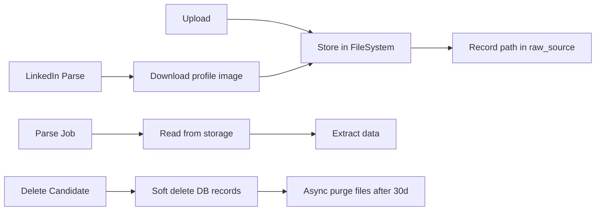

### 21.5 Constraints

| Constraint | Value |
|------------|-------|
| Max file size | 10 MB |
| Allowed resume types | PDF, DOCX |
| Allowed CSV/JSON types | text/csv, application/json |
| Profile image types | JPEG, PNG, WebP |
| Filename sanitization | Strip `../`, special chars; max 200 chars |

---

## 22. UI Specifications

### 22.1 Technology

- **Frontend:** React 18 + Vite + TypeScript
- **UI Library:** Tailwind CSS + shadcn/ui components
- **State:** TanStack Query for API caching
- **API:** REST primary; GraphQL for detail page field selection

### 22.2 Page 1 — Candidate Upload

**Route:** `/upload`

| Element | Description |
|---------|-------------|
| Resume dropzone | Accept PDF/DOCX; drag-and-drop |
| LinkedIn URL input | Validated URL field |
| GitHub URL input | Validated URL field |
| Recruiter CSV dropzone | Accept .csv |
| ATS Category JSON dropzone | Accept .json |
| Runtime Config textarea | JSON editor with syntax highlighting |
| Upload button | POST `/candidate/upload`; shows source IDs on success |
| Process Candidate button | POST `/candidate/process`; shows job ID; polls status |
| View Result button | Navigate to detail page for created candidate |

**States:** idle, uploading, upload-success, processing, process-complete, error

### 22.3 Page 2 — Candidate List

**Route:** `/candidates`

| Column | Source Field |
|--------|-------------|
| Profile Picture | `profilePicturePath` (avatar thumbnail) |
| Name | `fullName` |
| Email | primary email |
| Current Company | most recent experience company |
| Years Experience | `yearsExperience` |
| Confidence | `overallConfidence` (color-coded badge) |
| Last Updated | `updatedAt` |

**Features:**

- Search bar (debounced, searches name/email/company)
- Filters: confidence range slider, company dropdown, status
- Pagination: page size selector (20/50/100)
- Sort: clickable column headers
- Row actions: View, Delete (admin), Reprocess (admin)

### 22.4 Page 3 — Candidate Detail

**Route:** `/candidates/:id`

**Layout:** Header card (photo, name, headline, confidence badge) + tabbed content

| Tab | Content |
|-----|---------|
| Personal | Name, emails, phones, location, years experience |
| Skills | Tag cloud with confidence indicators |
| Experience | Timeline view with company, title, dates |
| Education | Institution, degree, dates |
| Social Links | LinkedIn, GitHub, portfolio links |
| Resume | Embedded PDF viewer or download link |
| Confidence | Table of field paths and scores |
| Provenance | Expandable tree: field → source → raw value |
| Raw Sources | List of ingested sources with status and errors |

---

## 23. Error Handling and Resilience

### 23.1 Exception Hierarchy

```
CandidateException (base)
├── SourceParseException       — parser failures (422)
├── ValidationException        — input/schema validation (400)
├── ProjectionException        — runtime config projection (422)
├── RateLimitExceededException — rate limit hit (429)
├── CandidateNotFoundException — not found (404)
└── ProcessingConflictException — already processing (409)
```

### 23.2 Global Exception Handler

```java
@RestControllerAdvice
public class GlobalExceptionHandler {

    @ExceptionHandler(SourceParseException.class)
    ResponseEntity<ProblemDetail> handleSourceParse(SourceParseException ex) {
        // RFC 7807 response with errorCode, requestId
    }

    @ExceptionHandler(MethodArgumentNotValidException.class)
    ResponseEntity<ProblemDetail> handleValidation(...) { ... }

    @ExceptionHandler(Exception.class)
    ResponseEntity<ProblemDetail> handleGeneral(Exception ex) {
        // Log full stack; return generic 500
    }
}
```

### 23.3 Per-Source Error Isolation

Each source is parsed independently within a try/catch. Failure of one source does not prevent processing of others. Candidate status reflects the outcome:

| Scenario | Candidate Status |
|----------|-----------------|
| All sources succeed | COMPLETED |
| Some sources fail | PARTIAL |
| All sources fail | FAILED |
| Processing in progress | PROCESSING |

### 23.4 Resilience4j Configuration

```yaml
resilience4j:
  retry:
    instances:
      githubApi:
        maxAttempts: 3
        waitDuration: 2s
        enableExponentialBackoff: true
        exponentialBackoffMultiplier: 2
  circuitbreaker:
    instances:
      linkedInScraper:
        failureRateThreshold: 50
        waitDurationInOpenState: 60s
        slidingWindowSize: 10
        minimumNumberOfCalls: 5
```

---

## 24. Sequence Diagrams (Detailed)

### 24.1 LinkedIn Scraper with Session Management

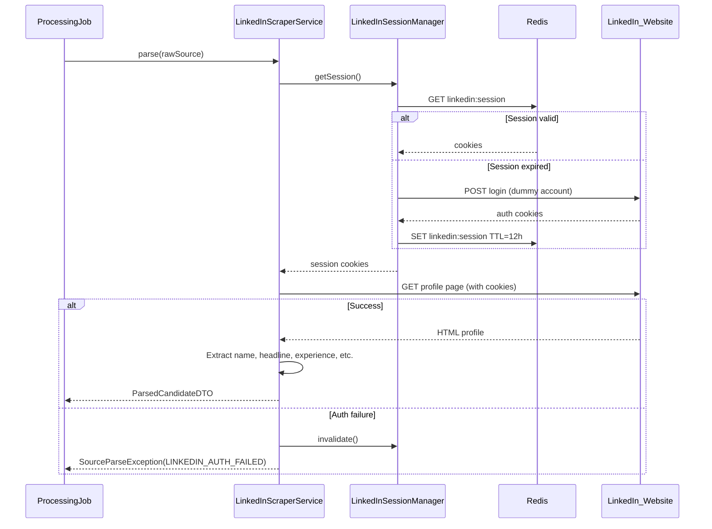

### 24.2 Email Validation with Cache

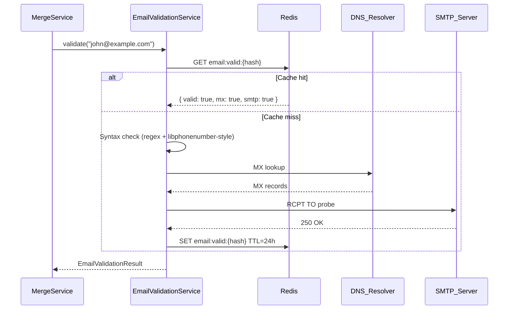

### 24.3 Full Pipeline (Combined)

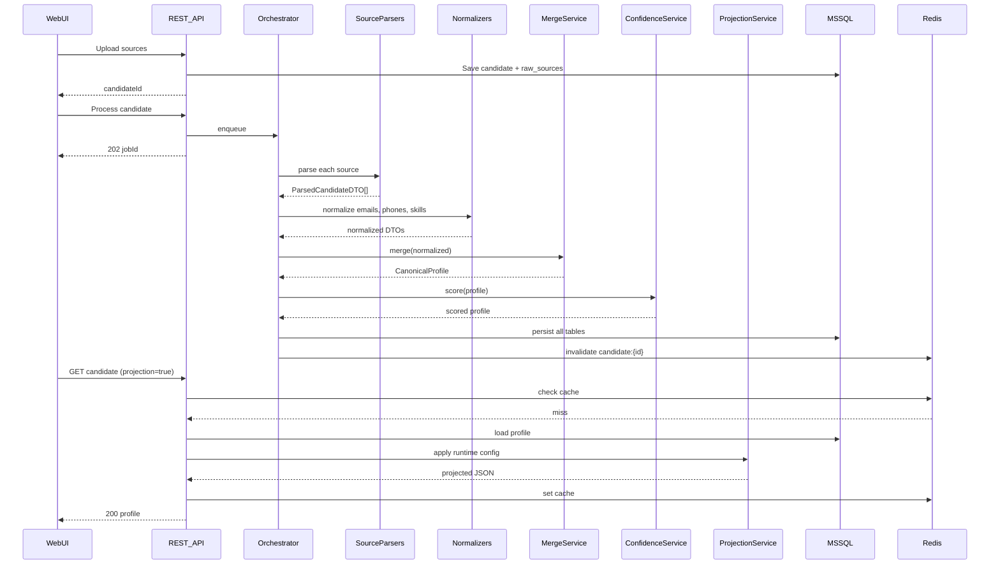

---

## Appendix A — Service Specifications

### A.1 Resume Parser Service

| Aspect | Detail |
|--------|--------|
| Input | PDF or DOCX file from file storage |
| Library | Apache Tika (text extraction) + regex/NLP heuristics |
| Extracts | Name, email, phone, experience, education, skills, companies, dates |
| Error handling | Corrupt file → `SourceParseException(RESUME_CORRUPT)` |

### A.2 LinkedIn Scraper Service

| Aspect | Detail |
|--------|--------|
| Auth | Dummy LinkedIn account; credentials from secrets manager |
| Session | Cookies persisted in Redis (`linkedin:session`); auto-refresh on 401 |
| Extracts | Name, headline, about, experience, education, skills, email, contact info, profile image, location, certifications |
| Resilience | Circuit breaker; 60s cooldown on repeated failures |

### A.3 GitHub Service

| Aspect | Detail |
|--------|--------|
| API | GitHub REST v3 + GraphQL v4 |
| Auth | Personal access token from secrets manager |
| Extracts | Name, username, bio, followers, following, public repos, languages, organizations, contributions, avatar, website |
| Cache | 1h Redis cache per username |
| Retry | 3 attempts with exponential backoff on 403/500 |

### A.4 CSV Import Service

| Aspect | Detail |
|--------|--------|
| Input | Recruiter CSV with configurable column mapping |
| Default mapping | `Full Name` → fullName, `Email` → emails, `Phone` → phones, `Skills` → skills |
| Error handling | Empty file → FAILED; malformed row → skip row + warn |

### A.5 ATS JSON Service

| Aspect | Detail |
|--------|--------|
| Input | ATS-specific JSON blob |
| Mapping | Configurable JSONPath mappings in `application.yml` |
| Error handling | Invalid JSON → FAILED; missing required fields → partial parse |

---

## Appendix B — Key Dependencies (Maven)

```xml
<dependencies>
    <!-- Spring Boot -->
    <dependency><!-- spring-boot-starter-web --></dependency>
    <dependency><!-- spring-boot-starter-data-jpa --></dependency>
    <dependency><!-- spring-boot-starter-validation --></dependency>
    <dependency><!-- spring-boot-starter-data-redis --></dependency>
    <dependency><!-- spring-boot-starter-graphql --></dependency>
    <dependency><!-- spring-boot-starter-security --></dependency>

    <!-- Database -->
    <dependency><!-- mssql-jdbc --></dependency>
    <dependency><!-- flyway-core --></dependency>

    <!-- Utilities -->
    <dependency><!-- mapstruct --></dependency>
    <dependency><!-- lombok --></dependency>
    <dependency><!-- apache-tika (resume parsing) --></dependency>
    <dependency><!-- libphonenumber (phone normalization) --></dependency>
    <dependency><!-- jayway-jsonpath (runtime config) --></dependency>

    <!-- Resilience -->
    <dependency><!-- resilience4j-spring-boot3 --></dependency>

    <!-- API Docs -->
    <dependency><!-- springdoc-openapi-starter-webmvc-ui --></dependency>

    <!-- AWS S3 (optional) -->
    <dependency><!-- aws-sdk-s3 --></dependency>
</dependencies>
```

---

*End of document.*
