# Technical Design: Multi-Source Candidate Profile Transformer

## Problem framing

Recruiting systems receive the same person in many shapes: PDF resumes, ATS JSON exports, recruiter spreadsheets, and GitHub profiles. Field names, formats, and completeness differ, yet downstream products need **one trustworthy candidate record**.

This system solves that by:

1. **Persisting inputs first** (upload latency stays low; reprocess without re-upload).
2. **Processing asynchronously** via a durable job queue and worker.
3. **Producing a canonical profile** with normalized scalars/collections, per-field confidence, and optional custom output projection.

The core tension is **fidelity vs. speed**: parsers can fail partially, LLM extraction can hallucinate, and sources conflict. The design favors **graceful degradation** (partial success beats total failure) and **explicit failure surfaces** (per-source errors + job polling for the UI).

---

## Pipeline (end-to-end)

```mermaid
flowchart LR
    ingest[Ingest_and_Persist]
    enqueue[Enqueue_Job]
    extract[Extract_Per_Source]
    parse[Parse_to_DTO]
    normalize[Normalize_Fields]
    merge[Merge_and_Dedupe]
    score[Assign_Confidence]
    persist[Persist_Canonical]
    project[Project_on_Read]
    validate[Validate_Output]

    ingest --> enqueue --> extract --> parse --> normalize --> merge --> score --> persist
    persist --> project --> validate
```



| Stage | What happens | Key components |
|-------|----------------|----------------|
| **Ingest & persist** | Create `candidate` (`DRAFT`), store files under `storage/`, create `raw_source` rows (`PENDING`), optionally save `runtime_config` | `CandidateService.upload` |
| **Enqueue** | Client calls `POST /process`; create `processing_job` (`QUEUED`), set candidate `PROCESSING` | `CandidateProcessingService.enqueue` |
| **Worker dispatch** | Spring `@Async` executor picks up job; `attempt_count` incremented; status `RUNNING` | `runAsync` + `processing_job` retry columns |
| **Extract & parse** | Per `SourceType`, run parser → `ParsedCandidateDTO` | `SourceParserFactory` |
| **Normalize** | Canonicalize emails, phones, dates, location strings, skill names before merge | `EmailValidationService`, `SkillNormalizationService` |
| **Merge & dedupe** | Apply source-priority rules; union collections with match keys | `CandidateProfileMerger` |
| **Score** | Item-level + field-group confidence; overall rollup | `populateFieldConfidence`, `baseConfidence` |
| **Persist** | Write merged entity graph; set candidate `COMPLETED` / `PARTIAL` / `FAILED` | JPA + Flyway schema |
| **Project on read** | Map canonical profile → client-specific JSON using stored runtime config | `ProfileProjectionService` at `GET /candidate/{id}?projection=true` |
| **Validate output** | Reject invalid projected shapes before response | `RuntimeConfigValidator`, `ProjectionException` |

**Failure notification (user-visible):** clients poll `GET /api/v1/candidate/{candidateId}/job/{jobId}` for `status`, `attemptCount`, `maxAttempts`, `errorMessage`.

See [CANDIDATE_PROFILE_TRANSFORMATION_SYSTEM.md](CANDIDATE_PROFILE_TRANSFORMATION_SYSTEM.md) for operational detail.

---

## Canonical output schema

| Group | Fields | Storage |
|-------|--------|---------|
| Identity | `candidateId`, `fullName`, `headline`, `yearsExperience`, `location` | `candidate` |
| Contact | `emails[]`, `phones[]` | `candidate_email`, `candidate_phone` |
| Career | `experience[]` | `candidate_experience` |
| Education | `education[]` | `candidate_education` |
| Skills | `skills[]` | `candidate_skill` |
| Links | `links[]` | `candidate_link` |
| Quality | `overallConfidence`, `confidence` map | `candidate`, `candidate_confidence` |
| Lineage | `provenance[]`, `sources[]` | `candidate_provenance`, `raw_source` |

### Normalization choices

| Dimension | Canonical format |
|-----------|------------------|
| **Dates** | `DATE`; partial dates as first of month or Jan 1 for year-only |
| **Phones** | E.164 when parseable |
| **Emails** | Lowercase; `validationStatus`: `valid` / `invalid` / `unknown` |
| **Location** | Single string: `"City, State, Country"` |
| **Skills** | `skill_name` + `canonical_skill` via `skill_alias` lookup |
| **Links** | Typed enum + URL |

---

## Merge and conflict-resolution policy

**Source priority:** `RESUME` → `GITHUB` → `ATS_JSON` → `RECRUITER_CSV`

Scalars use **first-non-null-wins** after priority sort. Collections are unioned with dedup keys (email lowercase, phone E.164, skill canonical lowercase, link URL). Experience and education are append-only.

### Confidence assignment

1. Per-item confidence from source type base score (Resume `0.95`, GitHub `0.70`, ATS `0.75`, CSV `0.50`)
2. Field-group confidence after merge (`0.85–0.95` populated, `0.30` empty)
3. Overall confidence = average of contributing sources' base scores

---

## Runtime custom-output config

Optional JSON on upload (`runtimeConfig`), stored in `runtime_config`. Read with `GET /candidate/{id}?projection=true`.

```json
{
  "fields": [
    { "path": "candidateName", "from": "full_name" },
    { "path": "primaryEmail", "from": "emails[0].address" }
  ],
  "includeConfidence": true,
  "includeProvenance": false,
  "missing": "omit"
}
```

- `from` resolves canonical paths (`full_name`, `emails[0].address`, `experience[0].company`, …)
- `missing: omit` drops unset fields; `null` emits explicit nulls
- Invalid config at upload → `400`; unknown `from` path at projection → `422`

---

## Edge cases

| Edge case | Handling |
|-----------|----------|
| One source fails, others succeed | `PARTIAL` candidate; per-source error metadata |
| All sources fail | `FAILED` |
| Worker crash | Retry up to `APP_PROCESSING_MAX_ATTEMPTS` |
| ATS `location` object | Flattened to string at parse time |
| Bad LLM JSON | Heuristic resume fallback |
| Duplicate email across sources | Dedup by lowercase address |

---
